# Database Schema Analysis - eLesen System

## Overview
This document provides a comprehensive analysis of the eLesen database schema, including table relationships and entity connections. The database appears to be a fishing license and management system for Malaysia, handling various aspects of fisheries management including vessel registration, crew management, applications, and subsistence payments.

## Key Entities and Relationships

### Core Entities
1. **Users** - System users (administrators, fishermen, officers)
2. **Vessels** - Fishing vessels with registration details
3. **Applications** - Various types of applications (licenses, permits)
4. **Entities** - Organizational entities (offices, departments)
5. **Code Masters** - Reference data (states, districts, application types)

### Major Relationship Groups

#### User Management
- `users` ↔ `user_role` ↔ `roles`
- `users` ↔ `user_module` ↔ `modules`
- `users` ↔ `user_histories`
- `users` ↔ `entities` (through entity_id)

#### Vessel Management
- `vessels` ↔ `users` (ownership)
- `vessels` ↔ `entities` (jurisdiction)
- `vessels` ↔ `kulit` (hull details)
- `vessels` ↔ `enjin` (engine details)
- `vessels` ↔ `pemilikan` (ownership records)
- `vessels` ↔ `lesen` (licenses)

#### Application Systems
- `applications` ↔ `code_masters` (application types, statuses)
- `applications_v2` ↔ `entities`
- `kru_applications` ↔ `users`, `entities`
- `darat_applications` ↔ `users`, `entities`

#### Subsistence Management
- `subsistence_application` ↔ `users`
- `subsistence_list` ↔ `entities`
- `subsistence_payments` ↔ `entities`
- `landing_declarations` ↔ `users`, `entities`

#### Crew Management
- `kru` ↔ `vessels`
- `nelayan_marins` ↔ `users`, `vessels`
- `foreign_crews` ↔ `vessels`

## Entity Relationship Diagram

```mermaid
erDiagram
    users ||--o{ user_role : has
    users ||--o{ user_module : accesses
    users ||--o{ user_histories : history
    users ||--o{ vessels : owns
    users ||--o{ applications : submits
    users ||--o{ subsistence_application : applies
    users ||--o{ landing_declarations : declares
    users ||--o{ kru_applications : applies
    users ||--o{ darat_applications : submits
    users ||--o{ nelayan_marins : is

    roles ||--o{ user_role : assigned
    modules ||--o{ user_module : granted

    entities ||--o{ users : employs
    entities ||--o{ vessels : manages
    entities ||--o{ applications_v2 : handles
    entities ||--o{ subsistence_list : generates
    entities ||--o{ subsistence_payments : processes
    entities ||--o{ landing_declarations : oversees

    code_masters ||--o{ applications : types
    code_masters ||--o{ vessels : references
    code_masters ||--o{ kru_applications : statuses

    vessels ||--o{ kulit : has
    vessels ||--o{ enjin : powered
    vessels ||--o{ pemilikan : owned
    vessels ||--o{ lesen : licensed
    vessels ||--o{ kru : crewed
    vessels ||--o{ foreign_crews : crewed
    vessels ||--o{ nelayan_marins : operated

    applications ||--o{ approvals : approved
    applications ||--o{ attachments : attached

    subsistence_application ||--o{ subsistence_doc : documented
    subsistence_application ||--o{ subsistence_audit_log_status : audited

    landing_declarations ||--o{ landing_infos : contains
    landing_infos ||--o{ landing_activity_species : records

    kru_applications ||--o{ kru_application_krus : crew
    kru_applications ||--o{ kru_application_foreign_krus : foreign_crew
    kru_applications ||--o{ kru_application_logs : logged

    darat_applications ||--o{ darat_application_logs : logged
    darat_applications ||--o{ darat_vessel_inspections : inspected
```



## Detailed Table Relationships

### User Management Relationships

#### users
- **Primary Key**: `id`
- **Relationships**:
  - One-to-many with `user_role` (user roles)
  - One-to-many with `user_module` (user permissions)
  - One-to-many with `user_histories` (user activity history)
  - One-to-many with `vessels` (vessel ownership)
  - One-to-many with `applications` (submitted applications)
  - One-to-many with `subsistence_application` (subsistence applications)
  - One-to-many with `landing_declarations` (landing declarations)
  - One-to-many with `kru_applications` (crew applications)
  - One-to-many with `darat_applications` (land applications)
  - One-to-many with `nelayan_marins` (marine fishermen)
  - Many-to-one with `entities` (employment)

#### roles
- **Primary Key**: `id`
- **Relationships**:
  - Many-to-many with `users` through `user_role`
  - One-to-many with `role_module` (role permissions)

#### modules
- **Primary Key**: `id`
- **Relationships**:
  - Many-to-many with `users` through `user_module`
  - Many-to-many with `roles` through `role_module`

### Vessel Management Relationships

#### vessels
- **Primary Key**: `id`
- **Relationships**:
  - Many-to-one with `users` (owner)
  - Many-to-one with `entities` (managing entity)
  - One-to-one with `kulit` (hull details)
  - One-to-many with `enjin` (engines)
  - One-to-many with `pemilikan` (ownership records)
  - One-to-many with `lesen` (licenses)
  - One-to-many with `kru` (crew members)
  - One-to-many with `foreign_crews` (foreign crew)
  - One-to-many with `nelayan_marins` (marine fishermen)

#### kulit
- **Primary Key**: `id`
- **Relationships**:
  - Many-to-one with `vessels` (vessel)
  - One-to-one with `muatan` (cargo capacity)

#### enjin
- **Primary Key**: `id`
- **Relationships**:
  - Many-to-one with `vessels` (vessel)

### Application Systems

#### applications
- **Primary Key**: `id`
- **Relationships**:
  - Many-to-one with `code_masters` (application type)
  - One-to-many with `approvals` (approval records)
  - One-to-many with `attachments` (attached documents)

#### applications_v2
- **Primary Key**: `id`
- **Relationships**:
  - Many-to-one with `entities` (handling entity)
  - Many-to-one with `users` (created by)

#### kru_applications
- **Primary Key**: `id`
- **Relationships**:
  - Many-to-one with `users` (applicant)
  - Many-to-one with `entities` (entity)
  - One-to-many with `kru_application_krus` (local crew)
  - One-to-many with `kru_application_foreign_krus` (foreign crew)
  - One-to-many with `kru_application_logs` (logs)

#### darat_applications
- **Primary Key**: `id`
- **Relationships**:
  - Many-to-one with `users` (applicant)
  - Many-to-one with `entities` (entity)
  - One-to-many with `darat_application_logs` (logs)
  - One-to-many with `darat_vessel_inspections` (inspections)

### Subsistence Management

#### subsistence_application
- **Primary Key**: `id`
- **Relationships**:
  - Many-to-one with `users` (applicant)
  - One-to-many with `subsistence_doc` (documents)
  - One-to-many with `subsistence_audit_log_status` (audit logs)

#### subsistence_list
- **Primary Key**: `id`
- **Relationships**:
  - Many-to-one with `entities` (entity)
  - Many-to-one with `subsistence_list_hqs` (HQ list)

#### subsistence_payments
- **Primary Key**: `id`
- **Relationships**:
  - Many-to-one with `entities` (entity)
  - One-to-many with `subsistence_payment_payees` (payees)

#### landing_declarations
- **Primary Key**: `id`
- **Relationships**:
  - Many-to-one with `users` (declarer)
  - Many-to-one with `entities` (entity)
  - One-to-many with `landing_infos` (landing information)
  - One-to-many with `landing_documents` (documents)

### Crew Management

#### kru
- **Primary Key**: `id`
- **Relationships**:
  - Many-to-one with `vessels` (vessel)

#### nelayan_marins
- **Primary Key**: `id`
- **Relationships**:
  - Many-to-one with `users` (user)
  - Many-to-one with `vessels` (vessel)
  - Many-to-one with `kru_application_krus` (application crew)

#### foreign_crews
- **Primary Key**: `id`
- **Relationships**:
  - Many-to-one with `vessels` (vessel)
  - Many-to-one with `kru_application_foreign_krus` (application)

## Key Business Processes

### 1. Vessel Registration Process
```
users → vessels → kulit/muatan → enjin → pemilikan → lesen
```

### 2. Crew Application Process
```
users → kru_applications → kru_application_krus/foreign_crews → approvals
```

### 3. Subsistence Application Process
```
users → subsistence_application → subsistence_doc → subsistence_list → subsistence_payments
```

### 4. Landing Declaration Process
```
users → landing_declarations → landing_infos → landing_activity_species
```

### 5. Land Application Process
```
users → darat_applications → darat_vessel_inspections → approvals
```

## Data Flow Patterns

### Hierarchical Structure
- **Entities** manage multiple aspects (users, vessels, applications)
- **Users** can have multiple roles and access multiple modules
- **Vessels** have multiple components (hull, engines, crew)

### Audit Trail
- Most tables include `created_by`, `updated_by`, `deleted_by` fields
- History tables track changes over time
- Log tables record status changes and approvals

### Document Management
- Multiple tables support document attachments
- File paths and metadata stored in dedicated tables
- Verification status tracking

### Status Management
- Complex status workflows for applications
- Hierarchical approval processes
- State-based transitions

This schema supports a comprehensive fisheries management system with multi-level approvals, document management, and complex relationships between users, vessels, and regulatory processes.