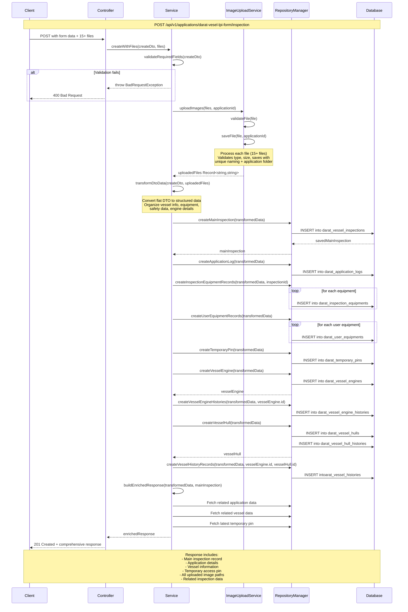

# Darat Vesel LPI Form Module - UML & Sequence Analysis

## Overview
The `darat-vesel-lpi-form` module is a complex NestJS module that handles vessel inspection forms for terrestrial fishing vessel licensing. It manages the complete inspection workflow including data validation, file uploads, multi-entity record creation, and comprehensive vessel inspection documentation.

## Module Structure

### Core Components
- **Controller**: `DaratVeselLpiFormController` - REST API endpoints
- **Service**: `DaratVeselLpiFormService` - Business logic and data processing  
- **Entity**: `DaratVeselLpiFormEntity` - Main inspection record mapping
- **DTO**: `CreateDaratVeselLpiFormDto` - Data transfer object with validation
- **ImageUploadService**: File upload handling service
- **Module**: `DaratVeselLpiFormModule` - Dependency injection configuration

## API Endpoints

### 1. Basic CRUD Operations
- `GET /api/v1/applications/darat-vesel-lpi-form` - Retrieve all inspection records
- `GET /api/v1/applications/darat-vesel-lpi-form/:id` - Retrieve specific inspection by ID
- `POST /api/v1/applications/darat-vesel-lpi-form` - Create basic inspection record

### 2. Complex Inspection with File Uploads
- `POST /api/v1/applications/darat-vesel-lpi-form/inspection` - **Main endpoint**
  - Handles multipart form data with multiple file uploads
  - Processes 15+ image fields including:
    - Engine images (enjinImg, noEnjinImg, penandaEnjinImg, turboImg, generatorImg)
    - Vessel photos (veselKiriImg, veselKananImg, veselHadapanImg, veselBelakangImg, veselKeseluruhanImg)
    - Safety equipment (MTUImg, AISImg)
    - Digital signatures (tandaTanganPembantuImg, tandatanganPegawaiImg, tandaTanganEmpunyaVeselImg)

## Data Model & Relationships

### Primary Entity
**DaratVeselLpiFormEntity**
- Maps to `darat_vessel_inspections` table
- 40+ fields covering vessel registration, inspection details, equipment status
- Foreign key relationships to applications and vessels

### Related Entities (11+)
1. **DaratApplicationEntity** - Application reference
2. **DaratVesselEntity** - Vessel information
3. **DaratApplicationLogEntity** - Audit trail
4. **DaratInspectionEquipmentEntity** - Equipment inspection records
5. **DaratUserEquipmentEntity** - User equipment declarations
6. **DaratTemporaryPinEntity** - Temporary access pins
7. **DaratVesselEngineEntity** - Engine specifications
8. **DaratVesselEngineHistorieEntity** - Engine history tracking
9. **DaratVesselHullEntity** - Hull inspection data
10. **DaratVesselHullHistorieEntity** - Hull modification history
11. **DaratVesselHistorieEntity** - General vessel history

## Business Logic Flow

### Main Inspection Process (`createWithFiles`)
1. **Validation**: Validates required fields and file constraints
2. **File Processing**: Upload and validate 15+ image files via ImageUploadService
3. **Data Transformation**: Convert flat DTO to structured business objects
4. **Main Record Creation**: Create primary inspection record
5. **Related Records Creation**: Create 8+ supporting records across multiple entities
6. **Response Assembly**: Build comprehensive response with related data

### Key Service Methods
- `validateRequiredFields()` - Input validation
- `processFileUploads()` - File handling via ImageUploadService
- `transformDtoData()` - Data structure conversion
- `createMainInspection()` - Primary record creation
- `createRelatedRecords()` - Supporting records batch creation
- `buildEnrichedResponse()` - Response compilation

## UML Class Diagram

```mermaid
classDiagram
    class DaratVeselLpiFormController {
        +findAll() Promise~DaratVeselLpiFormEntity[]
        +findOne(id: string) Promise~DaratVeselLpiFormEntity~
        +create(createDto: CreateDaratVeselLpiFormDto) Promise~DaratVeselLpiFormEntity~
        +createWithFiles(createDto: CreateDaratVeselLpiFormDto, files: any) Promise~CreateDaratVeselLpiFormDto~
    }

    class DaratVeselLpiFormService {
        -mainInspectionRepo: Repository~DaratVeselLpiFormEntity~
        -applicationRepo: Repository~DaratApplicationEntity~
        -vesselRepo: Repository~DaratVesselEntity~
        -imageUploadService: ImageUploadService
        +findAll() Promise~DaratVeselLpiFormEntity[]
        +findOne(id: string) Promise~DaratVeselLpiFormEntity~
        +create(createDto: CreateDaratVeselLpiFormDto) Promise~DaratVeselLpiFormEntity~
        +createWithFiles(createDto: CreateDaratVeselLpiFormDto, files: any) Promise~any~
        -validateRequiredFields(createDto: CreateDaratVeselLpiFormDto) void
        -processFileUploads(createDto: CreateDaratVeselLpiFormDto, files: any) Promise~Record~string,string~~
        -transformDtoData(createDto: CreateDaratVeselLpiFormDto, uploadedFiles: any) any
        -createMainInspection(transformedData: any) Promise~DaratVeselLpiFormEntity~
        -createRelatedRecords(transformedData: any, inspectionId: string) Promise~void~
        -buildEnrichedResponse(transformedData: any, mainInspection: DaratVeselLpiFormEntity) Promise~any~
    }

    class DaratVeselLpiFormEntity {
        +id: string
        +vessel_id: string
        +application_id: string
        +user_id: string
        +inspection_date: Date
        +valid_date: Date
        +inspection_location: string
        +inspected_by: string
        +is_support: number
        +inspection_summary: string
        +vessel_registration_number: string
        +vessel_condition: string
        +vessel_origin: string
        +hull_type: string
        +drilled: number
        +brightly_painted: number
        +vessel_registration_remarks: string
        +length: number
        +width: number
        +depth: number
        +engine_model: string
        +engine_brand: string
        +horsepower: number
        +engine_number: string
        +safety_jacket_status: number
        +safety_jacket_quantity: number
        +safety_jacket_condition: string
        +vessel_image_path: string
        +engine_image_path: string
        +engine_number_image_path: string
        +is_approved: number
        +is_active: number
        +created_by: string
        +updated_by: string
        +created_at: Date
        +updated_at: Date
        +daratApplication: DaratApplicationEntity
        +daratVessel: DaratVesselEntity
    }

    class CreateDaratVeselLpiFormDto {
        +userId: string
        +vesselId: string
        +applicationId: string
        +createdBy: string
        +updatedBy: string
        +noVesel: string
        +noVesel_ditebuk: boolean
        +noVesel_dicat: boolean
        +noVesel_diBumbung: boolean
        +tandaBahagianLaluan: boolean
        +hurufKodTanda: string
        +tinPlate: boolean
        +noTinPlate: string
        +pakuPenandaLebar: boolean
        +rumahKemudi_ditebuk: boolean
        +kodZon: string
        +rumahKemudi_diBumbung: boolean
        +jalurPutih: boolean
        +pukatTundaBerlesen_dicat: boolean
        +panjangMeter_dalamLesen: number
        +panjangMeter_semasaDiperiksa: number
        +lebarMeter_dalamLesen: number
        +lebarMeter_semasaDiperiksa: number
        +kedalamanMeter_dalamLesen: number
        +kedalamanMeter_semasaDiperiksa: number
        +muatanGRT_dalamLesen: number
        +muatanGRT_semasaDiperiksa: number
        +isNoPEV: boolean
        +noPEV: string
        +jenama_dalamLesen: string
        +jenama_semasaDiperiksa: string
        +model_dalamLesen: string
        +model_semasaDiperiksa: string
        +kuasaKuda_dalamLesen: number
        +kuasaKuda_semasaDiperiksa: number
        +noEnjin_dalamLesen: string
        +noEnjin_semasaDiperiksa: string
        +GPS: boolean
        +echoSounder: boolean
        +radar: boolean
        +satNavigation: boolean
        +sonar: boolean
        +fishFinder: boolean
        +radioWireless: boolean
        +ATUR: boolean
        +netHouler: boolean
        +powerBlock: boolean
        +netDrum: boolean
        +RSW: boolean
        +CCTV: boolean
        +peralatan_utama: string
        +peralatan_tambahan: string
        +peralatan_dijumpai: string
        +keadaanVeselSemasa: string
        +veselAsal: boolean
        +jenisKulitVesel: string
        +veselBaru: boolean
        +tarikhPemeriksaan: string
        +permohonan_diSokong: boolean
        +permohonan_tarikhPemeriksaan: string
        +jenisPermohonan: string
        +perakuanPemilik_tarikhPemeriksaan: string
    }

    class ImageUploadService {
        +uploadDir: string
        +maxFileSize: number
        +allowedMimeTypes: string[]
        +uploadImages(files: Express.Multer.File[], applicationId: string) Promise~Record~string,string~~
        -validateFile(file: Express.Multer.File) void
        -saveFile(file: Express.Multer.File, applicationId: string) Promise~UploadedFileInfo~
        +deleteImage(imagePath: string) Promise~void~
        +getImageUrl(imagePath: string) string~
        -ensureUploadDirectoryExists() Promise~void~
    }

    class DaratApplicationEntity {
        +id: string
        +status: ApplicationStatus
        +daratVesselInspection: DaratVeselLpiFormEntity
    }

    class DaratVesselEntity {
        +id: string
        +daratVesselInspection: DaratVeselLpiFormEntity
    }

    class DaratApplicationLogEntity {
        +id: string
        +application_id: string
        +remarks: string
        +created_by: string
    }

    class DaratInspectionEquipmentEntity {
        +id: string
        +application_id: string
        +user_id: string
        +inspection_id: string
        +name: string
        +type: string
    }

    class DaratUserEquipmentEntity {
        +id: string
        +application_id: string
        +user_id: string
        +name: string
        +type: string
    }

    class DaratTemporaryPinEntity {
        +id: string
        +application_id: string
        +pin_number: string
        +expires_at: Date
    }

    class DaratVesselEngineEntity {
        +id: string
        +vessel_id: string
        +user_id: string
        +model: string
        +brand: string
    }

    class DaratVesselEngineHistorieEntity {
        +id: string
        +vessel_engine_id: string
        +engine_brand: string
        +engine_model: string
    }

    class DaratVesselHullEntity {
        +id: string
        +vessel_id: string
        +user_id: string
        +hull_type: string
        +drilled: number
        +brightly_painted: number
    }

    class DaratVesselHullHistorieEntity {
        +id: string
        +vessel_hull_id: string
        +hull_type: string
        +drilled: number
        +brightly_painted: number
    }

    class DaratVesselHistorieEntity {
        +id: string
        +vessel_id: string
        +vessel_condition: string
        +vessel_registration_number: string
    }

    DaratVeselLpiFormController --> DaratVeselLpiFormService : uses
    DaratVeselLpiFormService --> DaratVeselLpiFormEntity : manages
    DaratVeselLpiFormService --> CreateDaratVeselLpiFormDto : validates
    DaratVeselLpiFormService --> ImageUploadService : delegates file handling
    DaratVeselLpiFormService --> DaratApplicationEntity : creates logs
    DaratVeselLpiFormService --> DaratVesselEntity : updates vessel data
    DaratVeselLpiFormService --> DaratInspectionEquipmentEntity : creates inspection records
    DaratVeselLpiFormService --> DaratUserEquipmentEntity : creates user equipment
    DaratVeselLpiFormService --> DaratTemporaryPinEntity : creates temporary access
    DaratVeselLpiFormService --> DaratVesselEngineEntity : creates engine records
    DaratVeselLpiFormService --> DaratVesselEngineHistorieEntity : creates engine history
    DaratVeselLpiFormService --> DaratVesselHullEntity : creates hull records
    DaratVeselLpiFormService --> DaratVesselHullHistorieEntity : creates hull history
    DaratVeselLpiFormService --> DaratVesselHistorieEntity : creates vessel history

    DaratVeselLpiFormEntity ||--|| DaratApplicationEntity : FK: application_id
    DaratVeselLpiFormEntity ||--o{ DaratVesselEntity : FK: vessel_id
```

## Sequence Diagram - Main Inspection Flow



## Key Technical Features

### File Upload Handling
- **Multi-file support**: Handles 15+ image file types
- **Validation**: File type, size, and security validation
- **Organization**: Files organized by application ID in subdirectories
- **Security**: Path validation to prevent directory traversal

### Data Transformation
- **Flat to Structure**: Converts 100+ flat DTO fields into organized business objects
- **Validation**: Comprehensive input validation with class-validator decorators
- **Type Conversion**: Automatic type transformation for numbers and booleans

### Database Integration
- **Multi-Entity**: Creates records across 11+ related entities
- **Transaction Safety**: Proper error handling and rollback capabilities
- **Audit Trail**: Comprehensive logging and history tracking
- **Foreign Key Management**: Proper relationship handling

### Error Handling
- **Validation Errors**: Detailed field-level validation feedback
- **File Upload Errors**: Specific file processing error messages
- **Database Errors**: Contextual database error handling with proper HTTP status codes
- **Conflict Resolution**: Duplicate record detection and handling

## Dependencies & Integration

### External Dependencies
- **NestJS**: Web framework and dependency injection
- **TypeORM**: Database ORM and entity management
- **Multer**: File upload middleware
- **Class Validator**: Input validation and transformation

### Module Integration
- **DaratApplicationsModule**: Application reference data
- **DaratVesselsModule**: Vessel information
- **Multiple Supporting Modules**: Equipment, logs, history tracking

## Business Process

### LPI (Live Performance Inspection) Workflow
1. **Application Processing**: Links to existing vessel application
2. **Inspection Planning**: Coordinates inspection date and location
3. **Physical Inspection**: Records vessel dimensions, engine details, hull condition
4. **Equipment Verification**: Validates safety and fishing equipment
5. **Documentation**: Captures photographic evidence and digital signatures
6. **Approval Process**: Generates temporary access pins and approval workflow
7. **Audit Trail**: Maintains comprehensive inspection history

### Use Cases
- **New Vessel Registration**: Complete inspection for new vessel licensing
- **License Renewal**: Re-inspection for existing vessel license renewals
- **Modification Inspection**: Inspection after vessel modifications
- **Compliance Auditing**: Random or scheduled compliance inspections

This analysis demonstrates the complexity and comprehensive nature of the vessel inspection system, handling everything from basic CRUD operations to complex multi-entity workflows with extensive file handling and validation capabilities.
