# Reverse Engineering: darat_applications Table

## Overview
The `darat_applications` table is part of the database schema in `dump.sql`. It appears to store application records related to "darat" (land-based) activities, likely for fisheries or marine applications in Malaysia. This document provides a reverse-engineered analysis of the table structure, relationships, and possible join queries.

## Table Schema
Based on the CREATE TABLE statement in `dump.sql` (lines 883-919):

```sql
CREATE TABLE `darat_applications` (
  `id` char(36) CHARACTER SET utf8mb4 COLLATE utf8mb4_unicode_ci NOT NULL,
  `user_id` char(36) CHARACTER SET utf8mb4 COLLATE utf8mb4_unicode_ci DEFAULT NULL,
  `application_type_id` char(36) CHARACTER SET utf8mb4 COLLATE utf8mb4_unicode_ci DEFAULT NULL,
  `application_status_id` char(36) CHARACTER SET utf8mb4 COLLATE utf8mb4_unicode_ci DEFAULT NULL,
  `created_by` char(36) CHARACTER SET utf8mb4 COLLATE utf8mb4_unicode_ci DEFAULT NULL,
  `updated_by` char(36) CHARACTER SET utf8mb4 COLLATE utf8mb4_unicode_ci DEFAULT NULL,
  `deleted_by` char(36) CHARACTER SET utf8mb4 COLLATE utf8mb4_unicode_ci DEFAULT NULL,
  `inspection_date` date DEFAULT NULL,
  `no_rujukan` varchar(20) CHARACTER SET utf8mb4 COLLATE utf8mb4_unicode_ci DEFAULT NULL,
  `is_appeal` tinyint(1) NOT NULL DEFAULT '0',
  `is_approved` tinyint(1) NOT NULL DEFAULT '0',
  `is_active` tinyint(1) NOT NULL DEFAULT '1',
  `deleted_at` timestamp NULL DEFAULT NULL,
  `created_at` timestamp NULL DEFAULT NULL,
  `updated_at` timestamp NULL DEFAULT NULL,
  `new_entity_id` char(36) CHARACTER SET utf8mb4 COLLATE utf8mb4_unicode_ci DEFAULT NULL,
  PRIMARY KEY (`id`),
  UNIQUE KEY `darat_applications_no_rujukan_unique` (`no_rujukan`),
  KEY `darat_applications_user_id_foreign` (`user_id`),
  KEY `darat_applications_application_type_id_foreign` (`application_type_id`),
  KEY `darat_applications_application_status_id_foreign` (`application_status_id`),
  KEY `darat_applications_created_by_foreign` (`created_by`),
  KEY `darat_applications_updated_by_foreign` (`updated_by`),
  KEY `darat_applications_deleted_by_foreign` (`deleted_by`),
  CONSTRAINT `darat_applications_application_status_id_foreign` FOREIGN KEY (`application_status_id`) REFERENCES `code_masters` (`id`) ON DELETE CASCADE,
  CONSTRAINT `darat_applications_application_type_id_foreign` FOREIGN KEY (`application_type_id`) REFERENCES `code_masters` (`id`) ON DELETE CASCADE,
  CONSTRAINT `darat_applications_created_by_foreign` FOREIGN KEY (`created_by`) REFERENCES `users` (`id`) ON DELETE SET NULL,
  CONSTRAINT `darat_applications_deleted_by_foreign` FOREIGN KEY (`deleted_by`) REFERENCES `users` (`id`) ON DELETE SET NULL,
  CONSTRAINT `darat_applications_updated_by_foreign` FOREIGN KEY (`updated_by`) REFERENCES `users` (`id`) ON DELETE SET NULL,
  CONSTRAINT `darat_applications_user_id_foreign` FOREIGN KEY (`user_id`) REFERENCES `users` (`id`) ON DELETE CASCADE
) ENGINE=InnoDB DEFAULT CHARSET=utf8mb4 COLLATE=utf8mb4_unicode_ci;
```

### Field Descriptions
- `id`: Primary key, UUID (char(36))
- `user_id`: Foreign key to `users.id` (applicant)
- `application_type_id`: Foreign key to `code_masters.id` (type of application)
- `application_status_id`: Foreign key to `code_masters.id` (status of application)
- `created_by`, `updated_by`, `deleted_by`: Foreign keys to `users.id` (audit fields)
- `inspection_date`: Date of inspection
- `no_rujukan`: Unique reference number (varchar(20))
- `is_appeal`: Boolean flag for appeal status
- `is_approved`: Boolean flag for approval status
- `is_active`: Boolean flag for active status
- `deleted_at`: Soft delete timestamp
- `created_at`, `updated_at`: Standard timestamps
- `new_entity_id`: Additional entity reference (char(36))

## Foreign Key Relationships
The table has several foreign key constraints:

1. `user_id` → `users.id` (CASCADE on delete)
2. `application_type_id` → `code_masters.id` (CASCADE on delete)
3. `application_status_id` → `code_masters.id` (CASCADE on delete)
4. `created_by` → `users.id` (SET NULL on delete)
5. `updated_by` → `users.id` (SET NULL on delete)
6. `deleted_by` → `users.id` (SET NULL on delete)

## Related Tables
Based on foreign key references found in the dump.sql, the following tables reference `darat_applications.id`:

1. `darat_application_approveds` (application_id)
2. `darat_application_logs` (application_id)
3. `darat_application_temps` (application_id)
4. `darat_inspection_equipments` (application_id)
5. `darat_item_founds` (application_id)
6. `darat_payment_receipts` (application_id)
7. `darat_temporary_pins` (application_id)
8. `darat_user_equipments` (application_id)
9. `darat_vessel_disposals` (application_id)
10. `darat_vessel_inspections` (application_id)

These tables appear to handle various aspects of the application lifecycle, including approvals, logs, temporary data, inspections, payments, and vessel-related operations.

## Possible Join Queries

### Basic Joins with Core Tables
```sql
-- Join with users table to get applicant information
SELECT da.*, u.name as applicant_name, u.email
FROM darat_applications da
INNER JOIN users u ON da.user_id = u.id;

-- Join with code_masters for application type and status
SELECT da.*, 
       cm_type.name as application_type,
       cm_status.name as application_status
FROM darat_applications da
INNER JOIN code_masters cm_type ON da.application_type_id = cm_type.id
INNER JOIN code_masters cm_status ON da.application_status_id = cm_status.id;
```

### Complex Joins with Related Tables
```sql
-- Join with application logs and approvals
SELECT da.no_rujukan, dal.remarks, daa.certificate_number, daa.approved_at
FROM darat_applications da
LEFT JOIN darat_application_logs dal ON da.id = dal.application_id
LEFT JOIN darat_application_approveds daa ON da.id = daa.application_id
WHERE da.is_active = 1;

-- Join with inspection and equipment data
SELECT da.no_rujukan, dvi.inspection_date, die.name as equipment_name, die.quantity
FROM darat_applications da
INNER JOIN darat_vessel_inspections dvi ON da.id = dvi.application_id
INNER JOIN darat_inspection_equipments die ON dvi.id = die.inspection_id
WHERE da.is_approved = 1;

-- Join with payment receipts
SELECT da.no_rujukan, dpr.receipt_number, dpr.payment_date, dpr.amount
FROM darat_applications da
INNER JOIN darat_payment_receipts dpr ON da.id = dpr.application_id
ORDER BY dpr.payment_date DESC;
```

### Comprehensive Query Example
```sql
-- Full application overview with user, type, status, and approval info
SELECT 
    da.id,
    da.no_rujukan,
    da.inspection_date,
    da.is_approved,
    u.name as applicant_name,
    u.email,
    cm_type.name as application_type,
    cm_status.name as application_status,
    daa.certificate_number,
    daa.approved_at,
    daa.expired_at
FROM darat_applications da
INNER JOIN users u ON da.user_id = u.id
INNER JOIN code_masters cm_type ON da.application_type_id = cm_type.id
INNER JOIN code_masters cm_status ON da.application_status_id = cm_status.id
LEFT JOIN darat_application_approveds daa ON da.id = daa.application_id
WHERE da.is_active = 1
ORDER BY da.created_at DESC;
```

## Entity-Relationship Diagram (Mermaid)

```mermaid
erDiagram
    darat_applications ||--o{ darat_application_approveds : "has"
    darat_applications ||--o{ darat_application_logs : "has"
    darat_applications ||--o{ darat_application_temps : "has"
    darat_applications ||--o{ darat_inspection_equipments : "has"
    darat_applications ||--o{ darat_item_founds : "has"
    darat_applications ||--o{ darat_payment_receipts : "has"
    darat_applications ||--o{ darat_temporary_pins : "has"
    darat_applications ||--o{ darat_user_equipments : "has"
    darat_applications ||--o{ darat_vessel_disposals : "has"
    darat_applications ||--o{ darat_vessel_inspections : "has"
    darat_applications }o--|| users : "belongs_to"
    darat_applications }o--|| code_masters : "application_type"
    darat_applications }o--|| code_masters : "application_status"
```


This reverse engineering provides a comprehensive view of the `darat_applications` table and its relationships within the database schema.