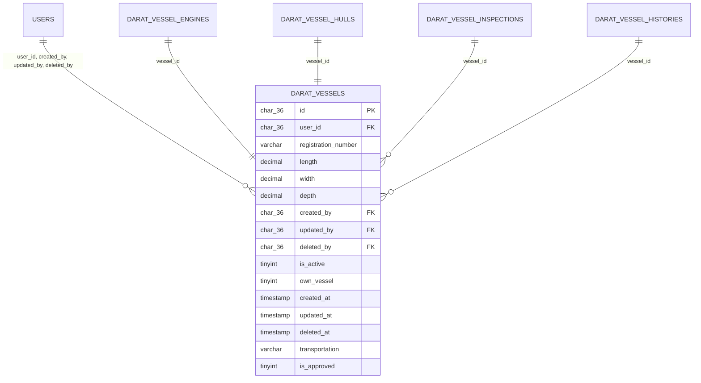

# ERD for Darat Vessels Table



# UML Class Diagram for Darat Vessels Table

```mermaid
classDiagram
    class DaratVessels {
        +char(36) id
        +char(36) user_id
        +varchar registration_number
        +decimal length
        +decimal width
        +decimal depth
        +char(36) created_by
        +char(36) updated_by
        +char(36) deleted_by
        +tinyint is_active
        +tinyint own_vessel
        +timestamp created_at
        +timestamp updated_at
        +timestamp deleted_at
        +varchar transportation
        +tinyint is_approved
    }
    Users --> DaratVessels : user_id, created_by, updated_by, deleted_by
    DaratVesselEngines --> DaratVessels : vessel_id
    DaratVesselHulls --> DaratVessels : vessel_id
    DaratVesselInspections --> DaratVessels : vessel_id
    DaratVesselHistories --> DaratVessels : vessel_id