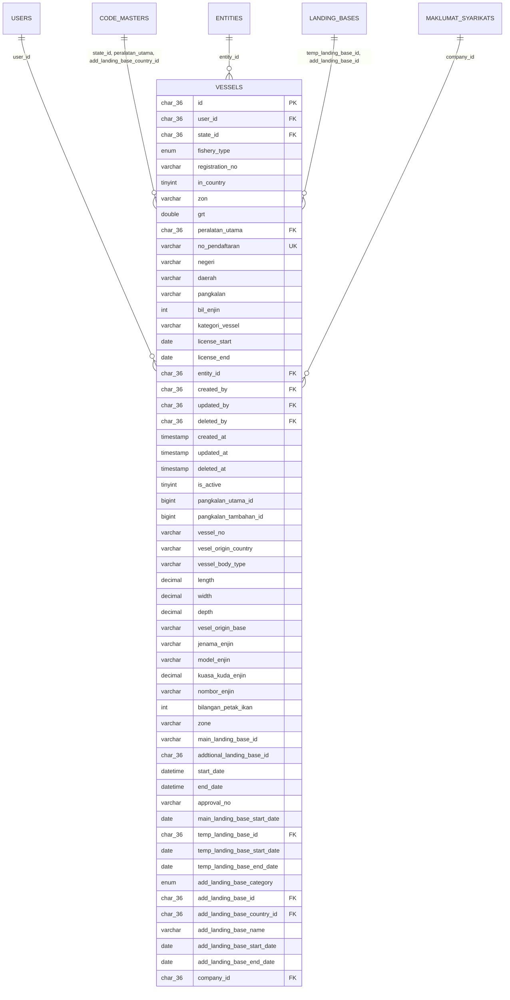

# ERD for Vessels Table



# UML Class Diagram for Vessels Table

```mermaid
classDiagram
    class Vessels {
        +char(36) id
        +char(36) user_id
        +char(36) state_id
        +enum fishery_type
        +varchar registration_no
        +tinyint in_country
        +varchar zon
        +double grt
        +char(36) peralatan_utama
        +varchar no_pendaftaran
        +varchar negeri
        +varchar daerah
        +varchar pangkalan
        +int bil_enjin
        +varchar kategori_vessel
        +date license_start
        +date license_end
        +char(36) entity_id
        +char(36) created_by
        +char(36) updated_by
        +char(36) deleted_by
        +timestamp created_at
        +timestamp updated_at
        +timestamp deleted_at
        +tinyint is_active
        +bigint pangkalan_utama_id
        +bigint pangkalan_tambahan_id
        +varchar vessel_no
        +varchar vesel_origin_country
        +varchar vessel_body_type
        +decimal length
        +decimal width
        +decimal depth
        +varchar vesel_origin_base
        +varchar jenama_enjin
        +varchar model_enjin
        +decimal kuasa_kuda_enjin
        +varchar nombor_enjin
        +int bilangan_petak_ikan
        +varchar zone
        +varchar main_landing_base_id
        +char(36) add_landing_base_id
        +datetime start_date
        +datetime end_date
        +varchar approval_no
        +date main_landing_base_start_date
        +char(36) temp_landing_base_id
        +date temp_landing_base_start_date
        +date temp_landing_base_end_date
        +enum add_landing_base_category
        +char(36) add_landing_base_id
        +char(36) add_landing_base_country_id
        +varchar add_landing_base_name
        +date add_landing_base_start_date
        +date add_landing_base_end_date
        +char(36) company_id
    }
    Users --> Vessels : user_id
    CodeMasters --> Vessels : state_id, peralatan_utama, add_landing_base_country_id
    Entities --> Vessels : entity_id
    LandingBases --> Vessels : temp_landing_base_id, add_landing_base_id
    MaklumatSyarikats --> Vessels : company_id